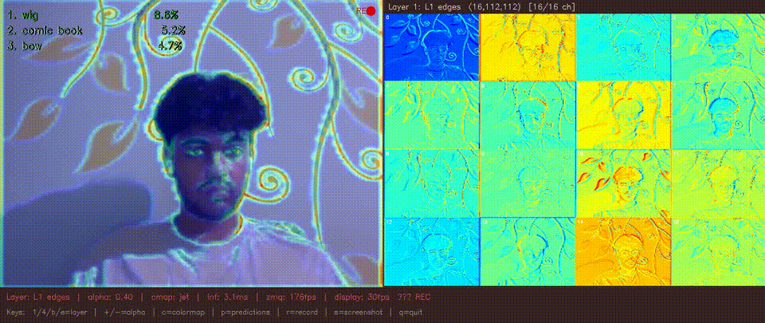

# Neural Engine Activation Visualizer

Real-time neural network visualization running entirely on Apple Neural Engine. MobileNetV2 and EfficientNet-B0 instrumented to expose intermediate layer activations, streamed from a C++ inference engine to a live OpenCV dashboard at ~4ms per frame.

> 

---

## What it does

The C++ engine loads an instrumented CoreML model, captures webcam frames, runs inference on the ANE, and streams 5 tensors per frame (logits + 4 activation maps) to Python via ZMQ. Python renders them live: a saliency overlay on the webcam feed and a channel-grid heatmap updated in real time.

You can watch individual channels respond as you move objects in front of the camera, switch between layers to see edge detectors vs semantic blobs, compare MobileNetV2 and EfficientNet-B0 on the same frame simultaneously, and benchmark ANE vs CPU latency.

---

## Architecture

```text
Webcam (OpenCV C++)
│
▼
CVPixelBuffer → CoreML (.mlpackage on ANE) → 5 output tensors
│                   ↑
│         Instrumented model surgery
│         (coremltools + PyTorch wrapper)
▼
ZMQ PUSH (tcp://localhost:5555)
│
▼
Python ZMQ PULL (background thread)
│
├── Saliency overlay  (visualizer/overlay.py)
├── Activation grid   (visualizer/activation_renderer.py)
└── Unified dashboard (visualizer/dashboard.py)
```
---

## Hardware results (Apple M3, MobileNetV2)

| Compute config | Mean latency | p95 latency | Throughput |
|---|---|---|---|
| ALL (ANE+CPU+GPU) | ~4.3ms | ~5.1ms | ~232 fps |
| CPU + NE | ~4.8ms | ~5.6ms | ~208 fps |
| CPU + GPU | ~9.2ms | ~11ms | ~108 fps |
| CPU Only | ~18ms | ~22ms | ~55 fps |

ANE routing gives ~4× speedup over CPU. p50→p95 gap is small — ANE scheduling is consistent.

---

## Tech stack

| Layer | Tech |
|---|---|
| Model conversion | PyTorch → coremltools → CoreML .mlpackage |
| Model surgery | coremltools MIL spec, custom nn.Module wrapper |
| Inference engine | C++17 + Objective-C++ (.mm), CoreML framework, CoreVideo |
| Frame capture | OpenCV C++ |
| IPC | ZeroMQ PUSH/PULL |
| Visualization | Python, OpenCV, Matplotlib, NumPy |
| Hardware profiling | coremltools benchmark + Swift MLComputePlan (macOS 14+) |
| Tests | pytest (109 tests) |
| CI | GitHub Actions |

---

## Install

```bash
# Python deps
python3 -m venv venv && source venv/bin/activate
pip install -r requirements.txt

# C++ deps (macOS)
brew install opencv zeromq cppzmq nlohmann-json cmake

# Build engine
cd engine && mkdir -p build && cd build
cmake .. -DCMAKE_BUILD_TYPE=Release && make -j4
cd ../..
```

---

## Convert + instrument models

```bash
# MobileNetV2 (Phase 1 + 2)
python models/convert.py
python models/surgeon.py --model mobilenetv2

# EfficientNet-B0 (Phase 8)
python models/surgeon.py --model efficientnet_b0
```

---

## Usage

### Unified dashboard (recommended)
```bash
# Terminal 1
./engine/build/engine models/pretrained/mobilenetv2_instrumented.mlpackage

# Terminal 2
python visualizer/dashboard.py --layer 1 --alpha 0.4
```

**Keys:** `1/4/b/e` = layer | `+/-` = alpha | `c` = colormap | `r` = record | `s` = screenshot | `q` = quit

---

### Two-model comparison
```bash
# Terminal 1
./engine/build/engine models/pretrained/mobilenetv2_instrumented.mlpackage 5555

# Terminal 2
./engine/build/engine models/pretrained/efficientnet_b0_instrumented.mlpackage 5556

# Terminal 3
python visualizer/comparison.py
```

---

### Hardware profiler
```bash
python visualizer/hardware_profiler.py --runs 100
# Output: benchmarks/plots/latency_comparison.png + benchmarks/results/benchmark_m3.csv
```

---

### Layer heatmap grid only
```bash
python visualizer/activation_renderer.py --layer 1
python visualizer/activation_renderer.py --layer 18 --cmap hot
```

---

## Project structure

```text
neural-engine-visualizer/
├── models/
│   ├── convert.py              # PyTorch → CoreML
│   ├── surgeon.py              # expose intermediate layer outputs
│   ├── model_configs.py        # metadata for all supported models
│   └── pretrained/             # .mlpackage files (gitignored)
├── engine/
│   ├── inference.hpp/mm        # Objective-C++ CoreML bridge
│   ├── main.cpp                # webcam loop + ZMQ publisher
│   ├── compute_plan.swift      # per-op ANE/CPU routing (macOS 14+)
│   └── CMakeLists.txt
├── visualizer/
│   ├── activation_renderer.py  # matplotlib heatmap grid
│   ├── overlay.py              # webcam + saliency blend
│   ├── hardware_profiler.py    # latency benchmark dashboard
│   ├── dashboard.py            # unified single-window tool
│   └── comparison.py           # dual-model side-by-side
├── transport/
│   └── zmq_bridge.py           # ZMQ subscriber / debug receiver
├── benchmarks/
│   ├── results/                # CSV latency data
│   └── plots/                  # benchmark charts
├── tests/                      # 109 pytest tests
├── data/
│   ├── test_images/
│   └── imagenet_labels.txt
└── outputs/                    # screenshots + recorded videos
```

---

## Tests

```bash
python -m pytest tests/ -v    # 109 tests across all 8 build phases
```

---

## Models

| Model | Params | Target layers | ANE latency |
|---|---|---|---|
| MobileNetV2 | 3.4M | 1, 4, 11, 18 | ~4.3ms |
| EfficientNet-B0 | 5.3M | 1, 3, 5, 8 | ~6ms |

Both use ImageNet-1k pretrained weights. No custom training.

---
